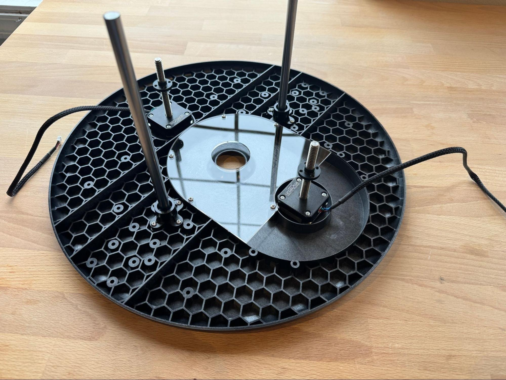
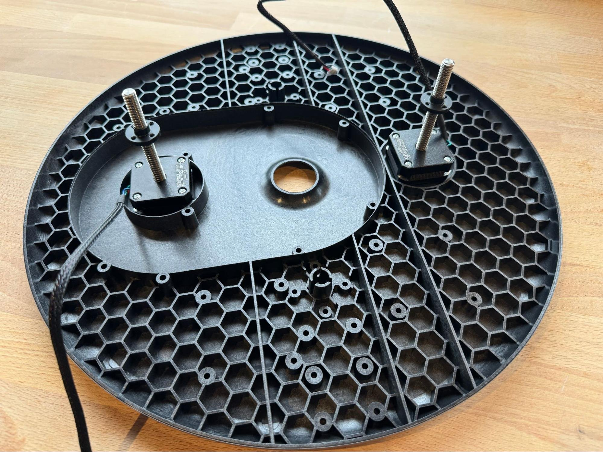
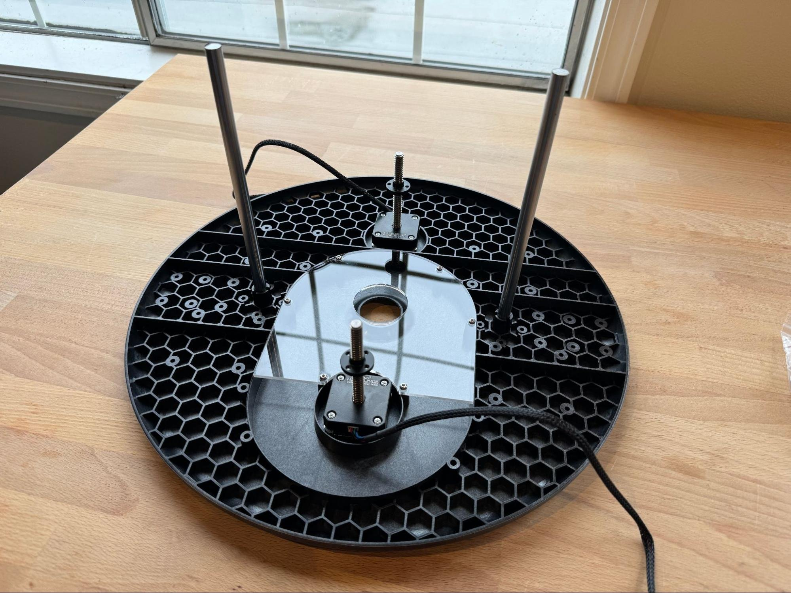
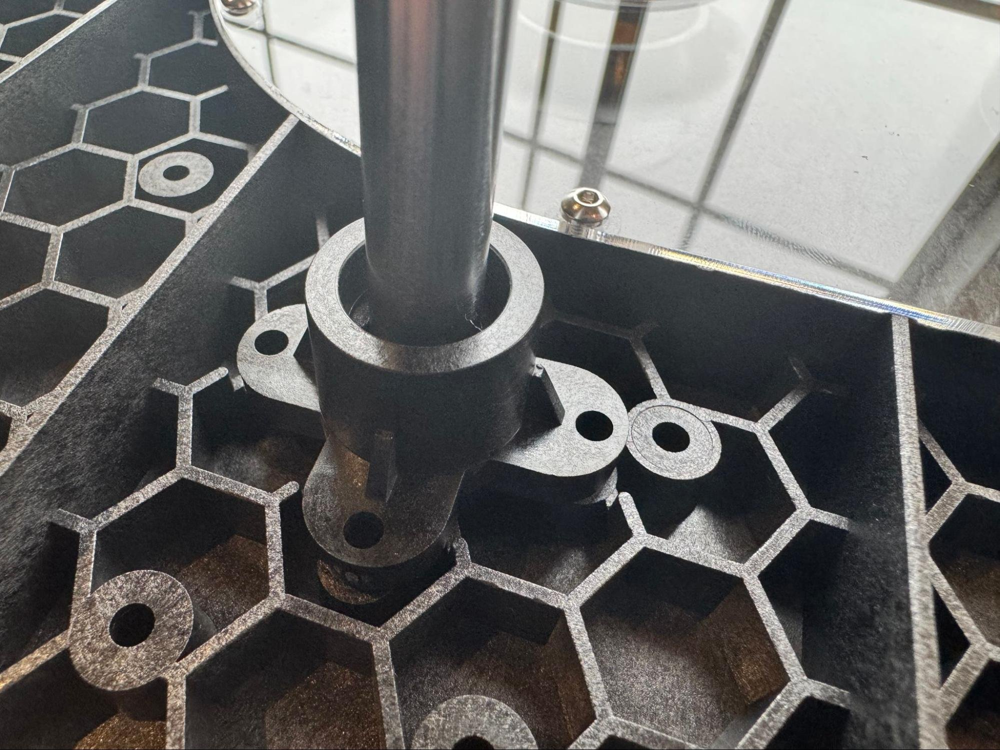
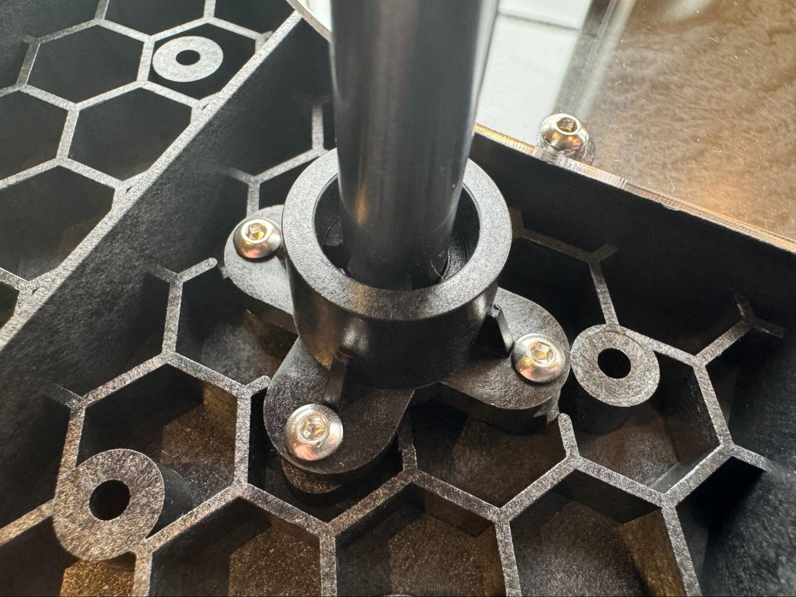

# Assembling The Sled

A video walkthrough of this process is available here: [Maslow 4.1 Sled Assembly Video](https://www.youtube.com/watch?v=w39uh0PZ4WY)

Find any of these steps confusing or get stuck? Don't forget, you aren't alone! Maslow is a community driven open source project. Ask in the [forums](https://forums.maslowcnc.com/) and we'll figure it out together!

Next we are going to assemble the Maslow4 sled. To do that we will need our sled, our stepper motors, our linear rods, our linear rod clamps, and our dust cover.

Amongst your hardware are a few bolts which are shorter than the rest. Find eight of these.

Using those eight smaller bolts attach the stepper motors to the sled by bolting through the sled and into the four threaded holes in each stepper motor. Orient the cords as shown in the next step.

Orient the stepper motors so that the cord is facing towards the edge of the sled.

Using six of the regular bolts and nuts attach the dust cover. I find it easier to flip the sled upside down for this step and drop the nuts down from the top and insert the bolt from the bottom.

Find your two linear rod clamps.

Because of our new and improved packing system these will likely be installed on the sled and you will need to take them off.

Insert linear rods into the two openings for them on either side of the sled. A GENTLE tap with a hammer can help make sure that they are fully seated.

Press the linear rod clamps into place around each rod.

Bolt them in place using eight bolts. Be careful to tighten these evenly going around in a circle and tightening each one gently before moving on to the next. Do not overtighten these. They do not need to be excessively tight and you can break the sled by tightening these too hard.

That's it! You've built your Maslow4's sled!

## Congratulations! Your sled is complete.

Next let's [assemble the router](../assembling-the-router-4-1/README.md).
