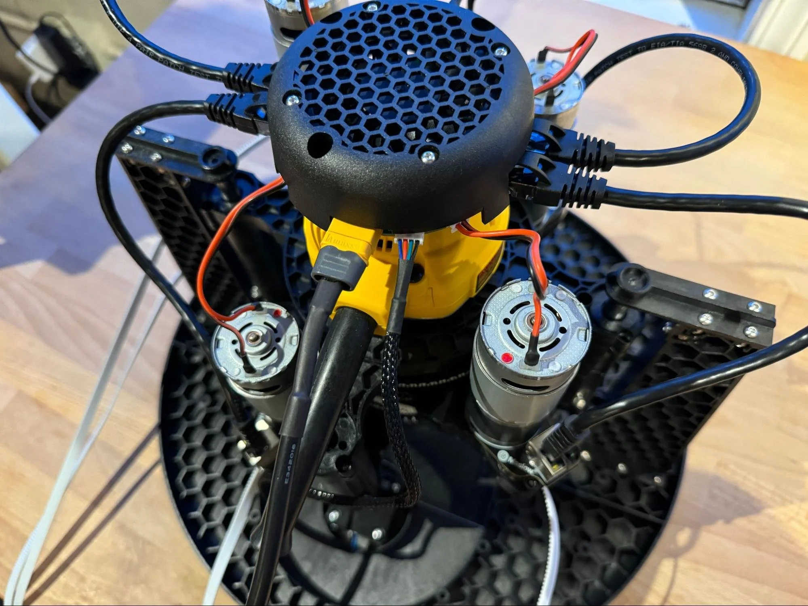
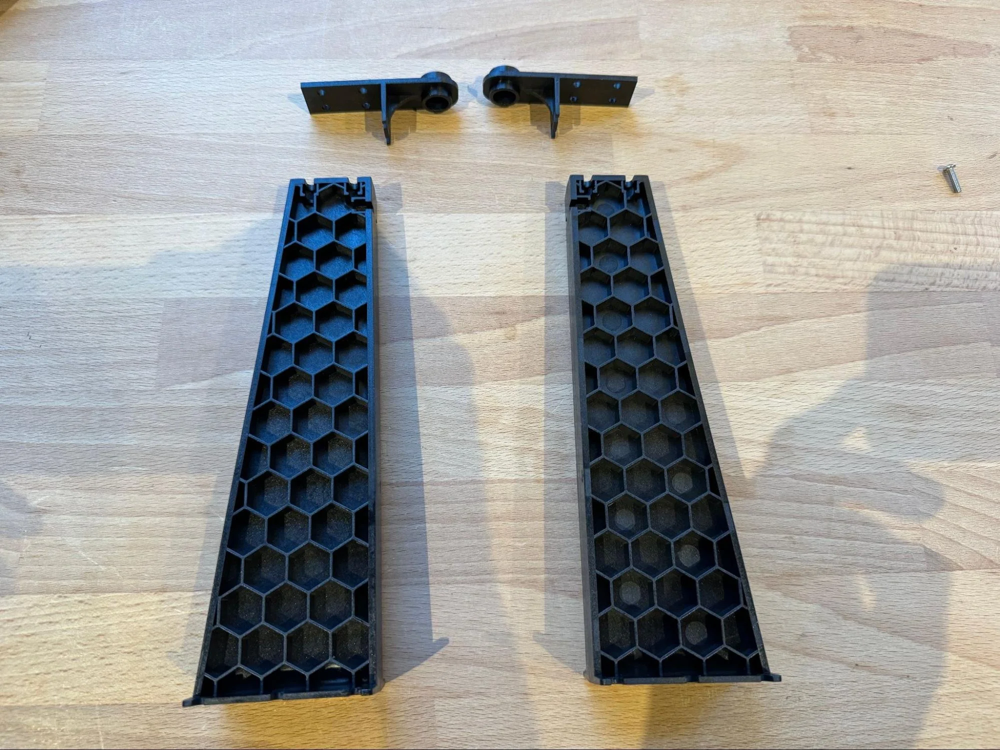
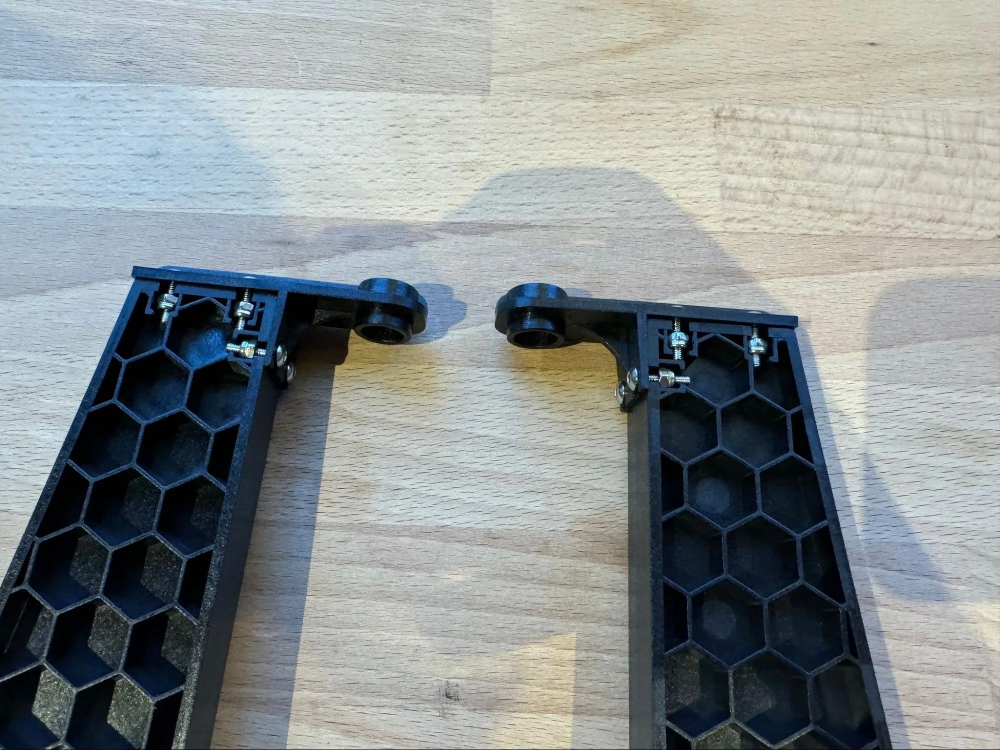
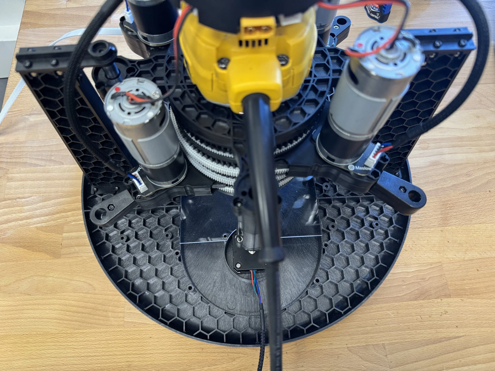
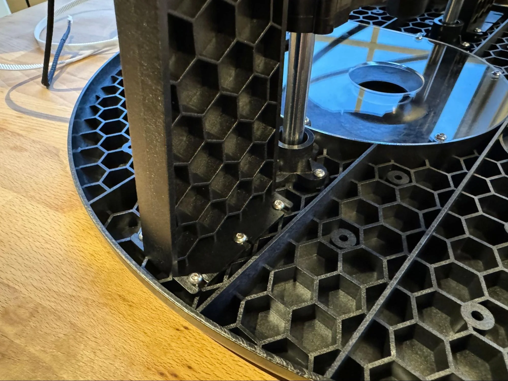
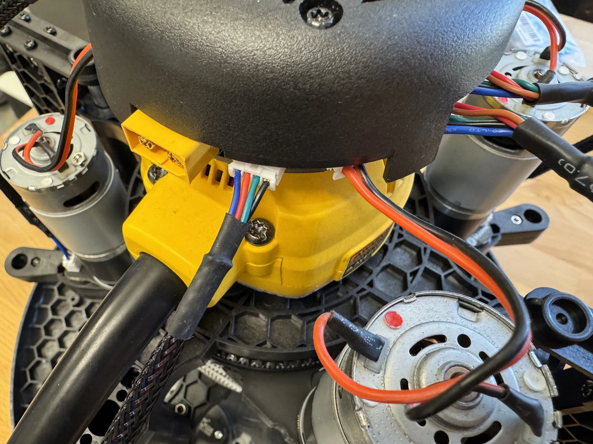
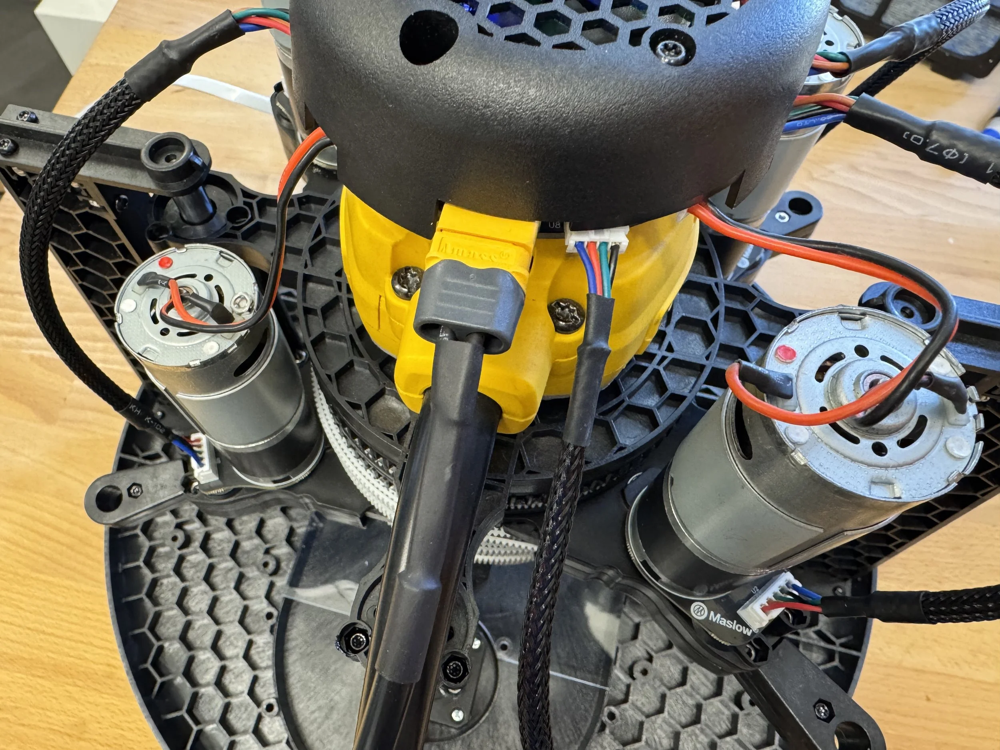

# Putting it all together

Let's bring it all together!

A video walkthrough of this process is available here: [Maslow 4.1 Final Assembly Video](https://www.youtube.com/watch?v=29Pf2GpZ3kI)

Find any of these steps confusing or get stuck? Don't forget, you aren't alone! Maslow is a community driven open source project. Ask in the [forums](https://forums.maslowcnc.com/) and we'll figure it out together!

First collect the two linear rod supports and the two linear rod support tops.

Attach the tops using six nuts and bolts each.

Place the router assembly onto the sled assembly orientated so that the power cord lines up with the dust collection port outlet.

Join the linear rod supports to the sled using six bolts each. There will be a small gap between the base of the upright and the sled initially, go around in a circle tightening each bolt gently to remove it.

Plug the two stepper motors into the controller board.

Plug in the power cord.

That's it! Your Maslow4 is complete.

Next let's learn how to update the firmware, update the user interface, and run the calibration process in the [Quick Start Guide](../QuickStart.md).

Note that at the end of this step your belts will be partly extended. We will retract them using the automatic belt retraction function after we update the firmware.

Have any questions or find anything confusing? Ask in the [forums](https://forums.maslowcnc.com/) and we'll figure it out together!
