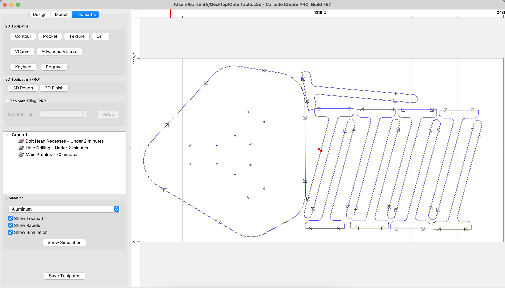
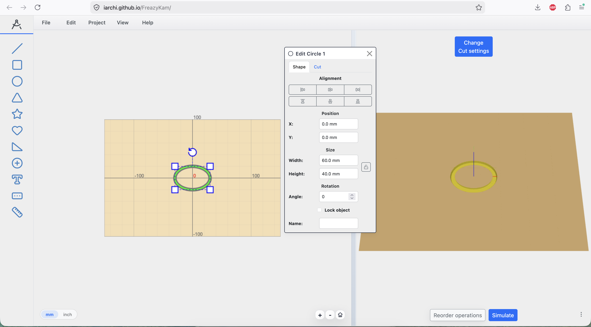
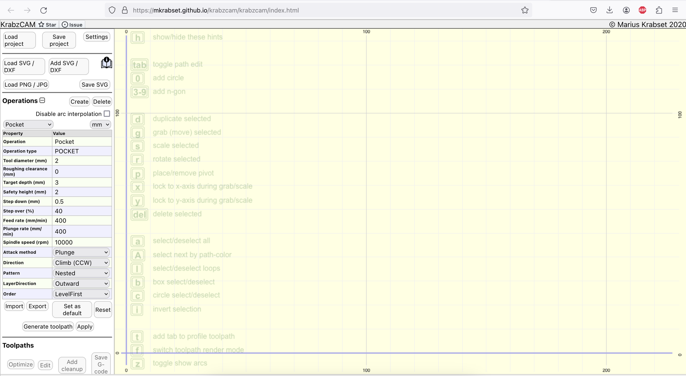
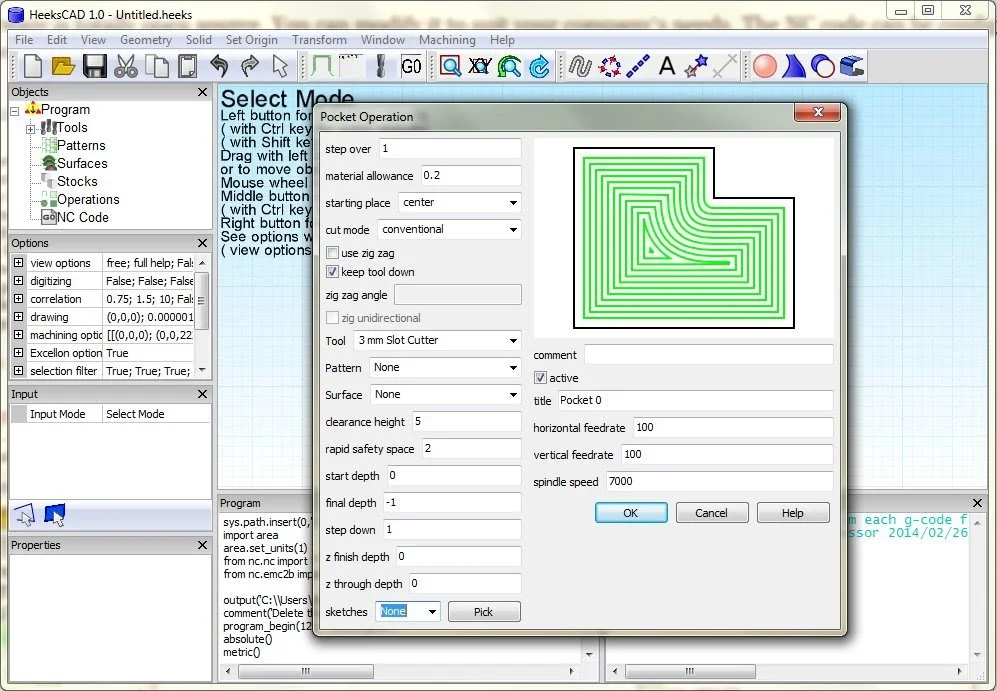
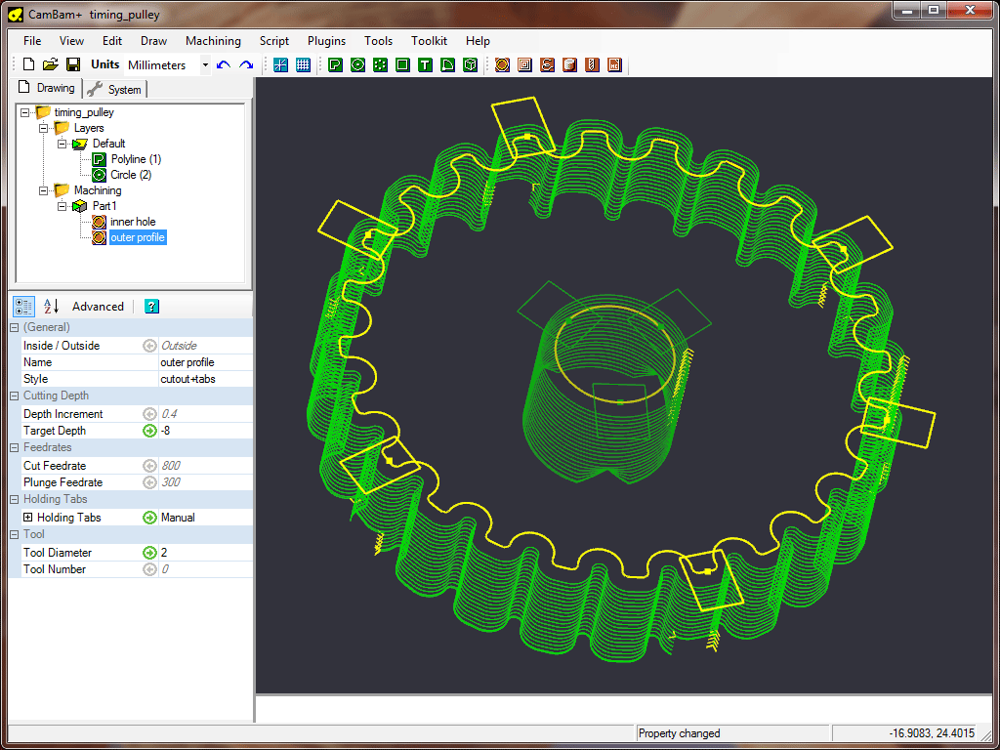
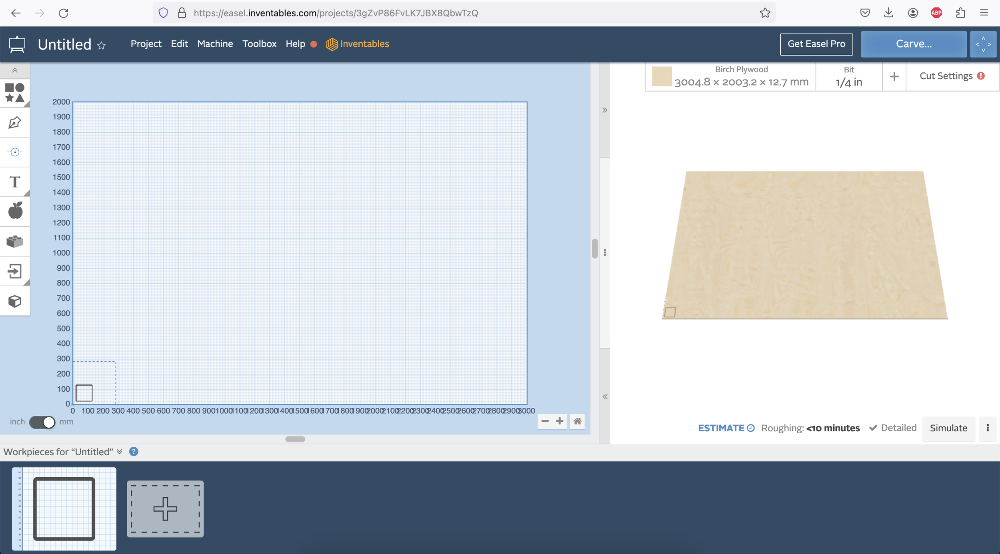
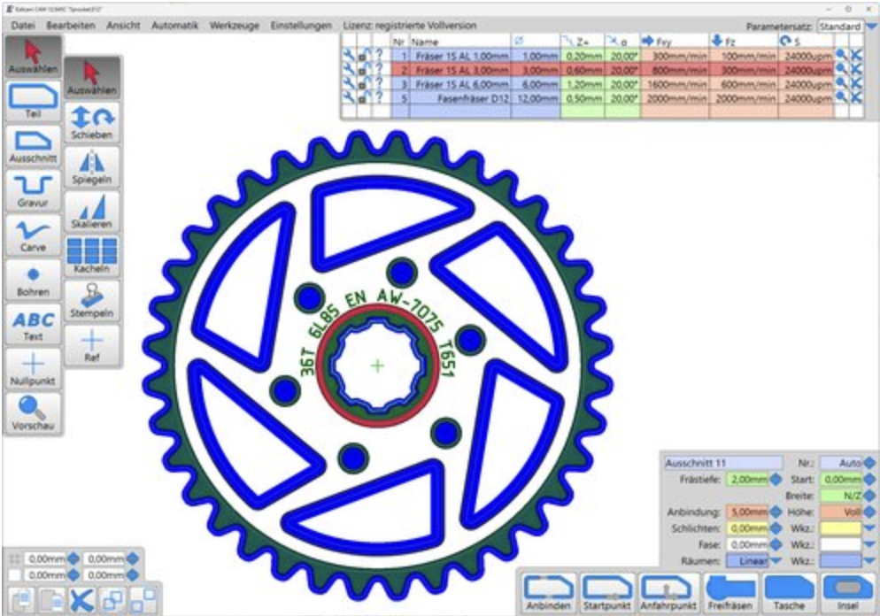
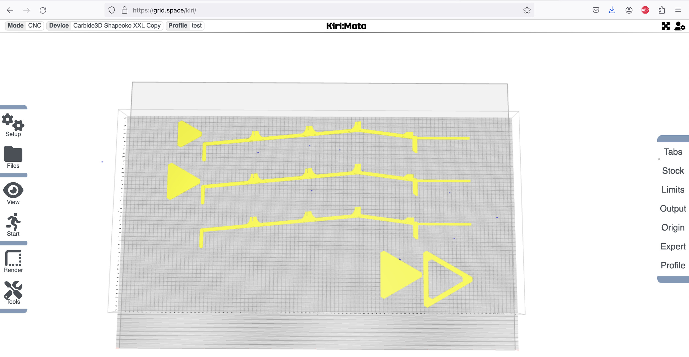
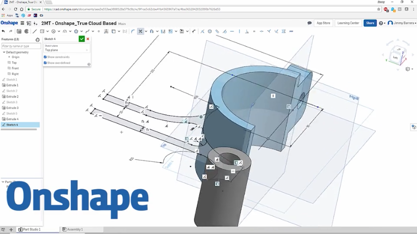

# Software Guide

Want to learn more about how to use any of these programs with Maslow4? Don't forget, you aren't alone! Maslow is a community driven open source project. Ask in the [forums](https://forums.maslowcnc.com/) and we'll figure it out together!

Before you purchase any of this software be aware that we are working on some free and open alternatives which should be available in the next six months.

## CAM Software

CAM software helps you take your 2D or 3D design and turn it into Gcode for your Maslow to cut.

FreazyKam is an excellent free online CAM option which can import .svg files or .dxf files and show how they will cut. It was developed in the maslow forums by the community so it is well supported if you encounter any issues.

CrabzCAM is a free online ([link](https://mkrabset.github.io/krabzcam/krabzcam/index.html)) tool for generating Gcode from .svg files. It is actively maintained and works well, however the number of options and settings can be overwhelming.

HeeksCNC is paid ($10 to own) CAM software which handles a large number of file types and can do 2D and 3D work. Windows only.

CamBam is a paid ($150 to own) CAM software. It does 2D and 3D work and can handle .dxf files.

CarbideCreate is paid ($120/year) CAM software which works well for 2D and basic 3D work. CarbideCreate is one of the only options which works on Mac.

Easel is a paid ($233/year) CAM software. People like it for it's easy to use interface.

Estlcam is a paid ($59 to own) CAM software. The interface looks a bit more well thought out than others and the creator is active in our forums if you have any questions.

Kiri:Moto is a free [online](https://grid.space/kiri/) CAM program with an unconventional interface.

## CAD Software

CAD software helps you create new 2D or 3D designs.

OnShape is a free CAD software as long as you are fine with your 3D models being public. The interface is similar to SolidWorks
